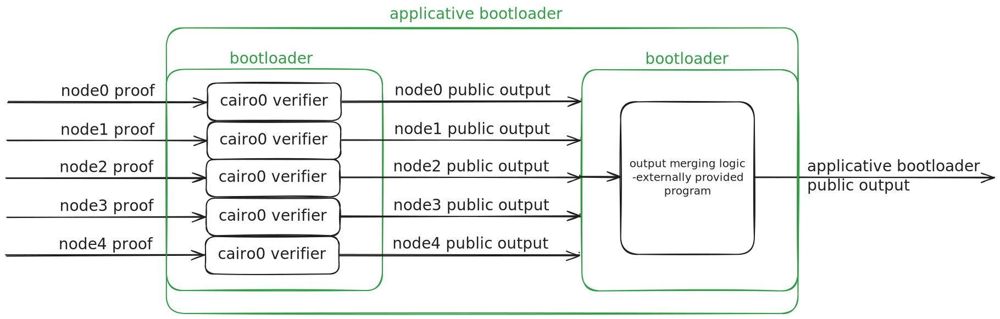
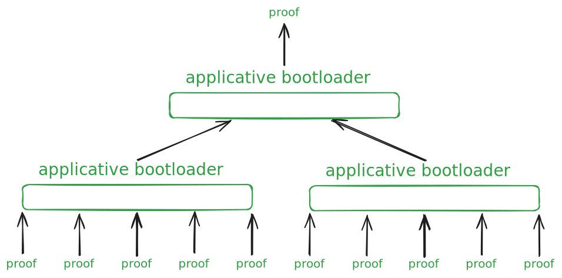

Here’s a refined version of your README with improved section descriptions, structure, and clarity.

---

# Applicative Bootloader

**Applicative Bootloader** is a Cairo0-based program designed to efficiently aggregate and merge proofs in a hierarchical, tree-like structure. It achieves this by verifying child proofs and applying custom aggregation logic to their outputs. The process is divided into two core operations:

1. **Verification:** Validates each child proof and extracts its result.
2. **Aggregation:** Merges the extracted results, producing a final output.

This enables a scalable structure where each level’s trace is proven, allowing the system to build subsequent layers seamlessly.

---

### Applicative Bootloader Architecture

The Applicative Bootloader operates in two distinct stages:

1. **Proof Verification & Output Extraction:** A multi-task bootloader verifies multiple proofs and collects their outputs.
2. **Output Aggregation:** A single-task bootloader applies the specified aggregation logic to the extracted outputs, combining them into a cohesive result.

<p align="center">
  
</p>

---

### Key Use Case

The main use case for the Applicative Bootloader is to merge several task-specific proofs into a single consolidated proof. This approach offers scalability for an arbitrary number of tasks while maintaining efficient public memory usage. It prevents memory growth from becoming unmanageable as the proof tree grows and allows for the implementation of custom, externally defined aggregation logic.

<p align="center">
  
</p>

---

### How to Run

To set up and run the Applicative Bootloader, follow these steps:

1. Initialize and update submodules:
   ```bash
   git submodule init && git submodule update
   ```

2. Set up the environment and compile:
   ```bash
   ./setup.sh && ./compile
   export PYTHONPATH=.:cairo-lang
   ```

3. Execute the following Python scripts:
   - Run the node input process:
     ```bash
     python input_node.py && python nodes_run.py
     ```

   - Prepare applicative bootloader inputs:
     ```bash
     python input_node_ar.py && python input_applicative_bootloader.py
     ```

   - Finally, run the applicative bootloader:
     ```bash
     python applicative_run.py
     ```

--- 

This README now provides a more user-friendly, professional introduction to the project while improving readability and flow. Let me know if you'd like further tweaks!